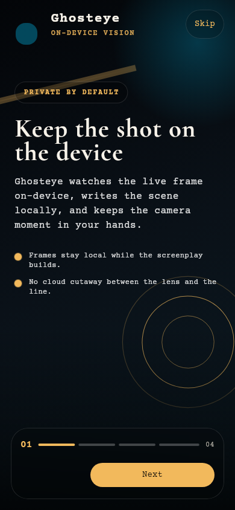
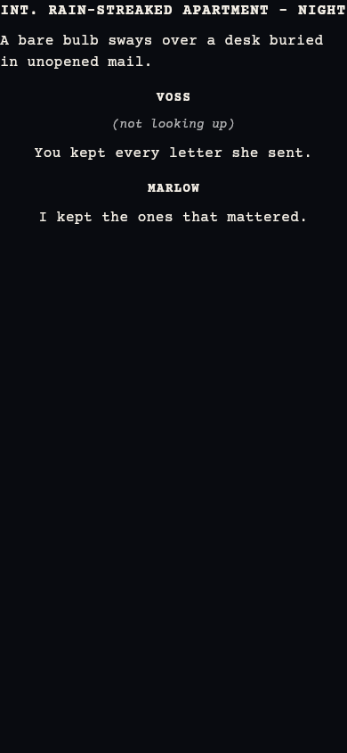
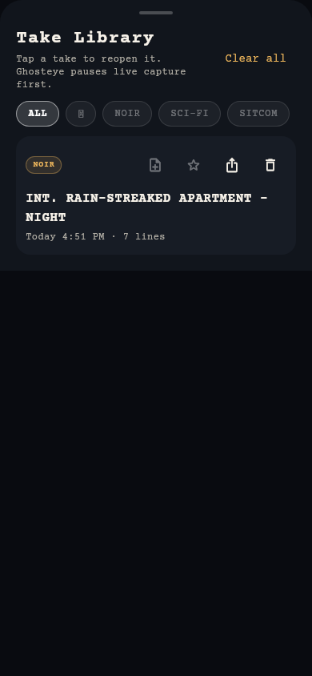

# Ghosteye

Ghosteye is a Flutter camera app that turns the live scene into scrolling screenplay text with an on-device Gemma vision model. Frames stay on-device, the output plays like a teleprompter, and the app can shift tone across `NOIR`, `SCI-FI`, and `SITCOM` modes.

## Screenshots

Real renders of the app's screens — the production widgets, theme and fonts —
captured headlessly at a 390x844 phone viewport. The screenplay formatting is
the app's own Fountain parser classifying a streamed token sequence, and the
take below is the one that run produced.

| Onboarding | Teleprompter | Take library |
|---|---|---|
|  |  |  |

The live camera feed and real Gemma inference need physical hardware, so they
are not pictured. See [docs/SCREENSHOTS.md](docs/SCREENSHOTS.md) for the full
set, what is and is not real in them, and `make screenshots` to regenerate.

## Status

- Mainline includes setup-handoff onboarding, source-aware setup, branded launch assets, local take history with frame thumbnails and shot notes, active/saved-take export, Model Center storage/source controls, performance presets, and persisted teleprompter controls.
- The mainline runtime targets Gemma 4 E2B on Android and physical iPhone hardware.
- Production hosting, real-device validation, release signing, and store assets are still in progress.
- Gemma 4 E4B remains a higher-memory follow-up after E2B physical-device validation.

## Highlights

- Four-step onboarding with a setup handoff before first setup
- Guided model setup workspace with managed-download and local-model install flows
- Live camera preview with screenplay-style streaming output
- One-handed director command dock for capture, history, export, clear, and tips
- Replayable director tips, local session history with per-take frame thumbnails and shot notes, and export/share for active or saved takes
- Model Center for active source, local storage, reset, source switching, privacy status, and pacing presets
- Persisted teleprompter controls for text size, line spacing, and streamed reveal pace
- Copyable technical diagnostics on setup failures for faster support triage
- GPU-first startup with visible CPU fallback status
- Local-first runtime with no server-side frame processing

## Supported Runtime

- Android: local debug builds supported
- iPhone: physical device testing supported
- iOS simulator: not a meaningful runtime signoff target for the current on-device Gemma stack

## Quick Start

1. Run `make config-copy`.
2. Set `GHOSTEYE_GEMMA_MODEL_URL` to a `.litertlm` or `.task` artifact you control.
3. Run `make bootstrap`.
4. Launch with `make run DEVICE=<device-id>` or `make run-android`.

If no managed URL or local model is configured, Ghosteye now stops at setup and tells you to provide one instead of falling back to a hardcoded legacy source.

## Model Setup

Ghosteye resolves model sources in this order:

1. A previously imported local model file stored by the app
2. `GHOSTEYE_GEMMA_MODEL_PATH`
3. `GHOSTEYE_GEMMA_MODEL_URL`

### Recommended: managed download

Use a managed URL you control:

```json
{
  "GHOSTEYE_GEMMA_MODEL_URL": "https://huggingface.co/litert-community/gemma-4-E2B-it-litert-lm/resolve/7fa1d78473894f7e736a21d920c3aa80f950c0db/gemma-4-E2B-it.litertlm",
  "GHOSTEYE_GEMMA_MODEL_TYPE": "gemma4",
  "GHOSTEYE_GEMMA_TOKEN": "optional_bearer_token_for_gated_downloads"
}
```

If the download is public, omit `GHOSTEYE_GEMMA_TOKEN`.

`GHOSTEYE_GEMMA_MODEL_TYPE` defaults to `gemma4`. The current runtime dependency supports `gemma4`, `gemmaIt`, `general`, `deepSeek`, `qwen`, `qwen3`, `llama`, `hammer`, `functionGemma`, and `phi`; use non-default values only for local model-family tests.

### Local model options

- Import a local model from the splash screen when setup fails or when you want to sideload a file into app storage.
- Use a direct local-path override for support or internal testing:

```bash
flutter run \
  --dart-define=GHOSTEYE_GEMMA_MODEL_PATH=/absolute/path/to/gemma-4-E2B-it.litertlm \
  --dart-define=GHOSTEYE_GEMMA_MODEL_TYPE=gemma4
```

Imported models are copied into app storage and reused on later launches until you switch back to the managed download path.

## Privacy

- Camera frames stay on-device.
- Gemma inference runs locally.
- Network access is only used to fetch the managed model artifact when you configure a URL source.

## Maintainer Commands

The repo ships with a `Makefile` for common setup and verification commands:

```bash
make help
make bootstrap
make config-copy
make config-check
make devices
make verify
make run DEVICE=<device-id>
make run-android
make run-ios IOS_DEVICE=<physical-device-id>
make run-local-model MODEL_PATH=/absolute/path/to/gemma-4-E2B-it.litertlm MODEL_TYPE=gemma4
make build-apk-release
make build-appbundle-release
make docs-audit
```

Android release builds require a local `android/key.properties` file that points at a production keystore. Copy `android/key.properties.example`, fill in the local values, and keep both `android/key.properties` and keystore files out of git.

## Project Docs

- [CONTRIBUTING.md](CONTRIBUTING.md): maintainer workflow and doc-sync rules
- [LICENSE](LICENSE): MIT license for the repository
- [RELEASE_CHECKLIST.md](RELEASE_CHECKLIST.md): GitHub and app-release blockers
- [docs/DEVICE_TEST_PLAN.md](docs/DEVICE_TEST_PLAN.md): physical Android/iPhone validation script
- [plan.md](plan.md): current implementation checklist and explicit blockers
- [roadmap.md](roadmap.md): prioritized follow-up work and acceptance criteria
- [agents.md](agents.md): agent handoff with runtime decisions and guardrails

## Release Readiness

Ghosteye is close to public GitHub shape, with MIT licensing, passing local verification, and GitHub Actions verification in place. The remaining app-release blockers are tracked in [RELEASE_CHECKLIST.md](RELEASE_CHECKLIST.md), [plan.md](plan.md), and [roadmap.md](roadmap.md), with the biggest items being production model hosting, physical-device validation, local release credentials, store assets, and support/privacy links.
