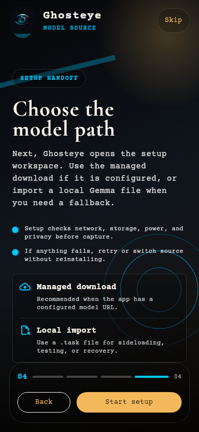
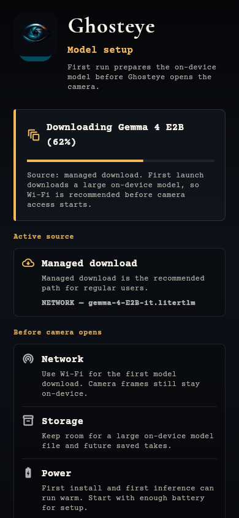
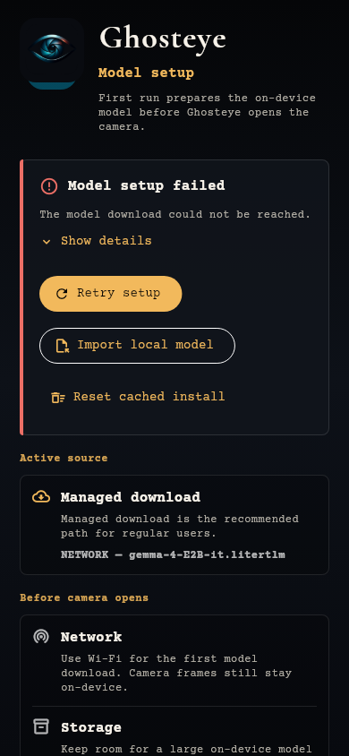
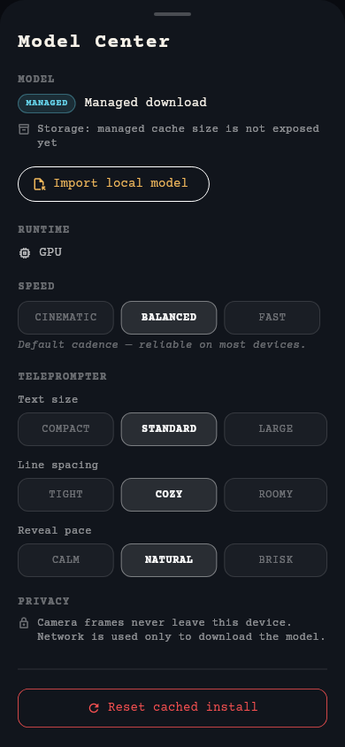
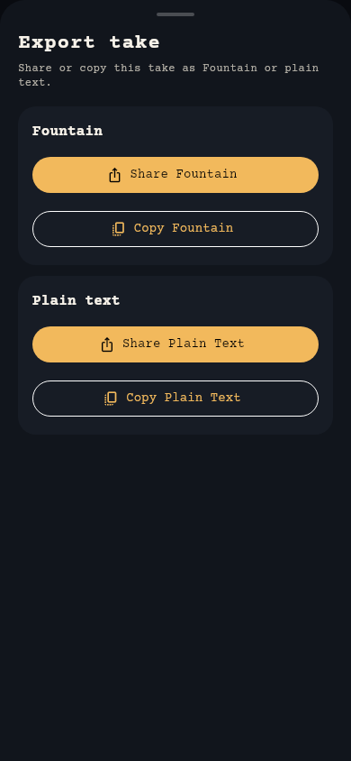
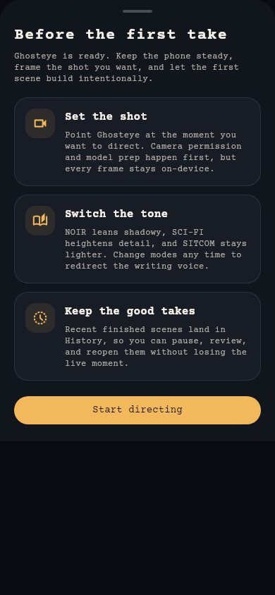

# Screenshots

Rendered from the real widget tree — the actual screen widgets, the actual
`AppTheme`, and the app's real fonts — captured headlessly at a 390x844 phone
viewport.

Regenerate them with:

```bash
make screenshots
```

## What is real here, and what is not

These are **not** mockups. Each image is the production widget rendered by
Flutter. Two of them go further and exercise real app logic rather than
hand-built fixtures:

- **The teleprompter** was produced by streaming a scene through the real
  `ScriptController` token API (`startResponse` / `appendToken` /
  `finishResponse`). The slugline, action, character, parenthetical and
  dialogue styling you see is the app's own Fountain classifier deciding how to
  format each line.
- **The take library** card was not constructed by hand either. It is the take
  that the teleprompter run above produced, after it synced through
  `ScriptHistoryService` — which is why it reports its own line count.
- **The export sheet** lists the entries from that same parsed take.

The setup and Model Center shots drive the real screens through fixed
`GemmaState` phases, so the copy, the failure classification and the source
details are the app's own — no model is installed to produce them.

What these images **cannot** show is the two things that need physical
hardware:

- **The live camera feed.** `DirectorCameraPreview` needs a real plugin
  `CameraController`, so the Director screen's camera layer is not captured.
- **Real Gemma 3n inference.** The screenplay text above is a fixed sample fed
  through the parser, *not* model output. On-device inference needs an ARM
  device and a real model file.

So: the UI, the theme, the typography, the screenplay formatting and the take
persistence are all genuine. The camera frame and the model's authorship are
not represented.

## Onboarding

The four-step first-run flow. The last step hands off to the setup workspace,
where the model source is chosen.

| Intro | Model source handoff |
|---|---|
|  |  |

## Teleprompter

The live screenplay surface. Everything below the slugline was classified by
the app's Fountain parser from a raw token stream.


## Setup

The first-run model setup workspace, in progress and in failure. The failure
view carries a per-kind support hint and a copyable technical block behind
"Show details", so support and QA can diagnose without native logs.

| Installing | Failure with diagnostics |
|---|---|
|  |  |

## Model Center and export

Active source, backend and storage controls; and the export sheet that hands a
take off as Fountain or plain text.

| Model Center | Export |
|---|---|
|  |  |

## Take library and director tips

Recent takes persist locally with a mode tag and line count. The tips sheet is
what pauses the scene before the first capture.

| Take library | Director tips |
|---|---|
|  |  |

## How the harness works

`tool/screenshots/generate_screenshots.dart` is a `flutter_test` file kept
outside `test/` so the CI suite never runs it — the same isolation the
`benchmark/` directory uses. It needs no network access.

Two details are load-bearing, and both were failure modes first:

1. **Fonts must be registered per test.** The brand faces are bundled in
   `assets/fonts` and declared in `pubspec.yaml`, but `flutter test` does not
   load an app's declared fonts automatically — without registering them every
   glyph renders as a filled box. This happens in `setUp`, not `setUpAll`,
   because the test binding resets registered fonts between test cases, so
   loading once would only serve the first screenshot. Material's icon font
   ships with the Flutter SDK rather than the app and needs the same treatment,
   or every `Icon` draws as an empty square.
2. **Capture goes through `matchesGoldenFile`.** A manual
   `RenderRepaintBoundary.toImage()` writes a correct PNG but leaves the test
   shell unable to shut down, so the run hangs after the file lands.

Pumping is bounded rather than `pumpAndSettle()`, whose ten-minute default
timeout turns any never-settling animation into a ten-minute stall.
